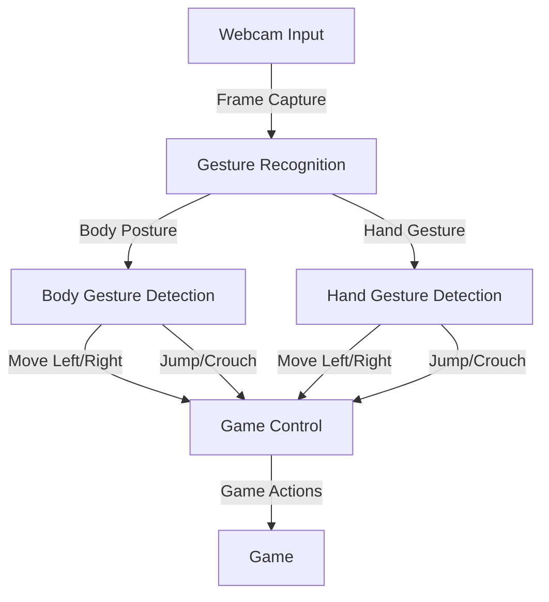

# Project Architecture

The **Gesture Control Game** project is designed with a modular architecture to ensure scalability and maintainability. Below is an overview of the system architecture and components.

## System Workflow

The following diagram illustrates the flow of data from the webcam input to the final game control:

